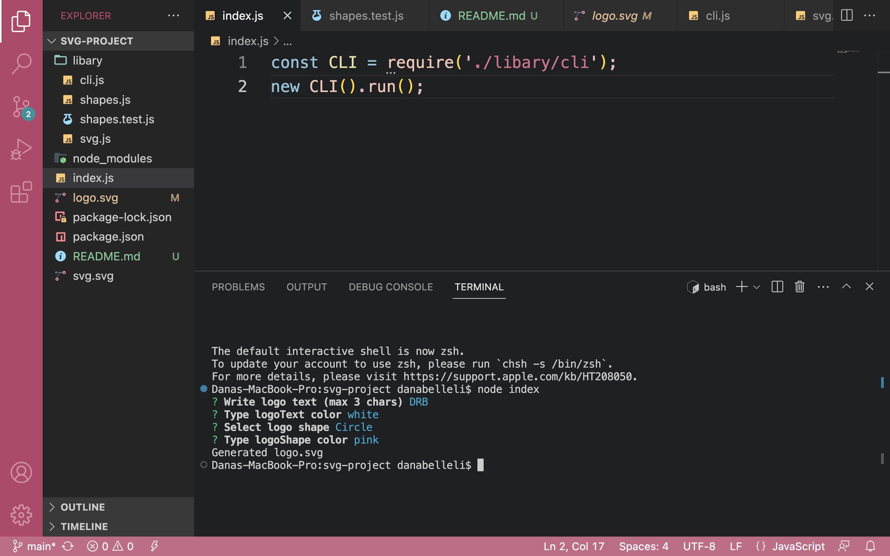

# SVG Generator

## Description

This is an SVG generator app in the command line. Based on the user's input it will generate the SVG logo as an svg file.

## Installation

Run npm i to install the npm packages.

## Usage

In order to create your SVG logo, you will need to run node index in your terminal. Then, you will be prompted with questions. At the end, an svg file will be generated with the logo, based on your input. 

## License

N/A
